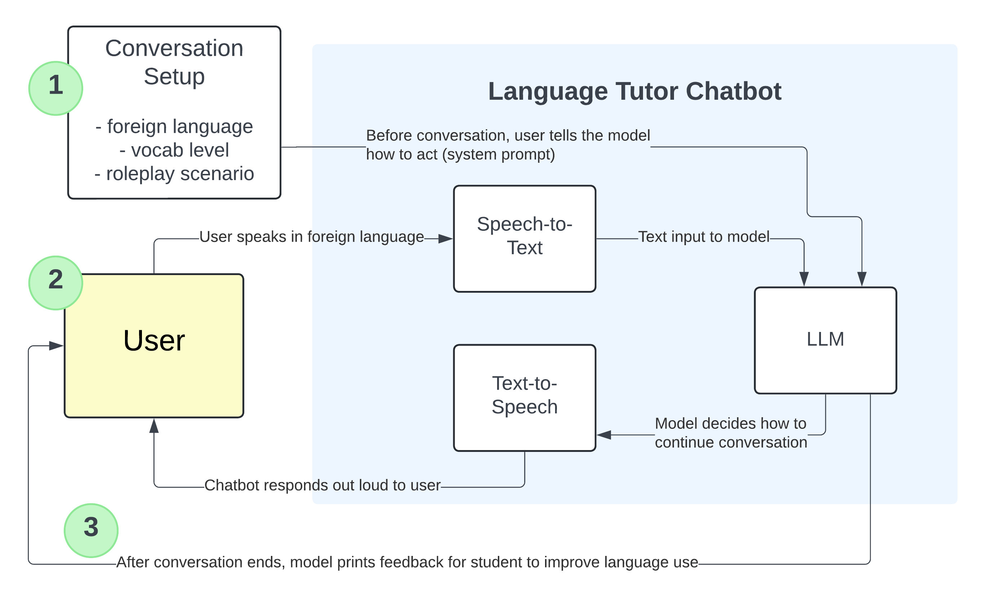

# language-tutor-ai
Building a foreign language speech-to-speech chatbot 

----------

I've always enjoyed studying foreign languages. I studied Spanish in high school and learned Mandarin Chinese while serving a two-year mission in Taiwan. While planning a trip with friends to Asia, I decided to learn my 4th language: Japanese. To help myself practice, I'm building this chatbot. 

Here's the design.

## Architecture

### LLM: Conversation
The underlying language model will be a text-to-text conversation model. Ideally it will be multilingual with high proficiency in English, Japanese, Mandarin and Spanish. I would also like a model that is small enough to run on my own computer (or in Google Colab) and free or very cheap. Bonus points if the model can process and output very quickly so I can simulate real-time conversation. I can scale things up as needed. I'll investigate models such as OpenAI's GPT 4, Google's Gemini and others.

I will engineer prompts for this model including things such as:
* use only A1-A2 vocabulary/grammar in Spanish
* [personality, backstory]
* continue the conversation in character until a certain point, then give me feedback

### Speech-to-text: Understanding me
I'll need another model to understand my speech and convert it to text. This may be extra difficult because I am not a native speaker, so my accent may sound strange or my words will be broken up as I'm trying to figure out what to say. Again, this is ideally a quick model so we can simulate real-time speech.

### Text-to-speech: Giving the model a voice
I'd also like to find a voice generator for the model (perhaps one where I can plug in different accents/ages/sexes based on the conversation scenario). Small, free, and fast are all ideal.

For Tutor 2.0, I could build my own model.

### [Optional] Animate model
I could use set images/gifs or even render video of the model speaking, so it would feel more personal.

### [Optional] Web app
I could host this application online so anyone could practice speaking to my language tutor. Perhaps I could even gather feedback/metrics from users.

### [Optional] English base model
Some speech-to-text models (like OpenAI's Whisper) convert from English to the target language. So I could use a base LLM that is English, and just do translation in the text-audio steps to/from the target language.

## Implementation

I'm still putting the pieces together, but I'll post the code for my v1.0 language tutor here as it comes along.